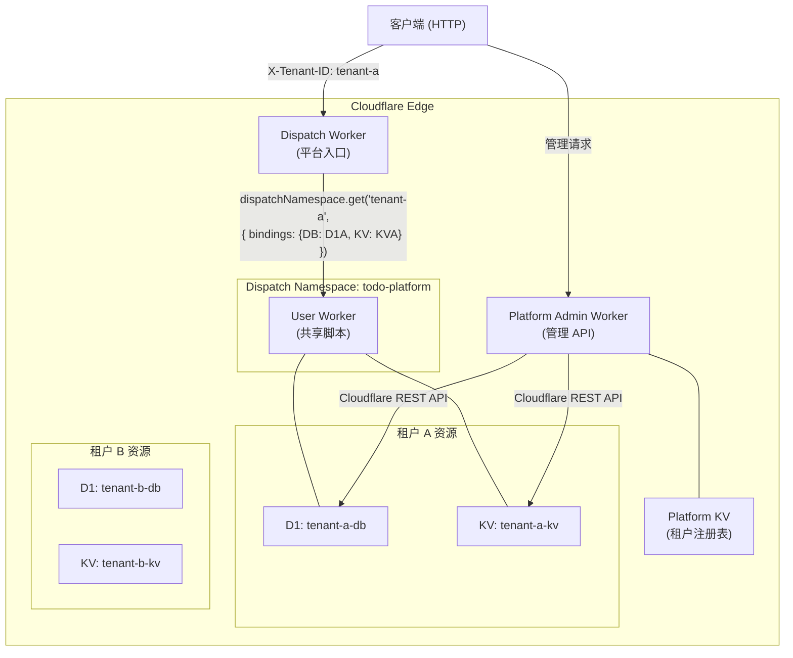
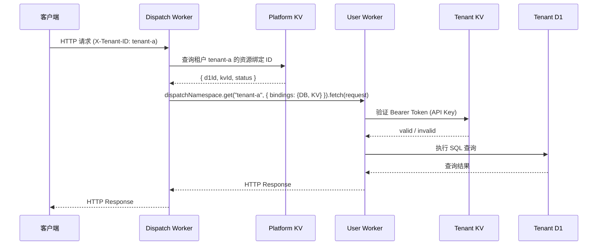
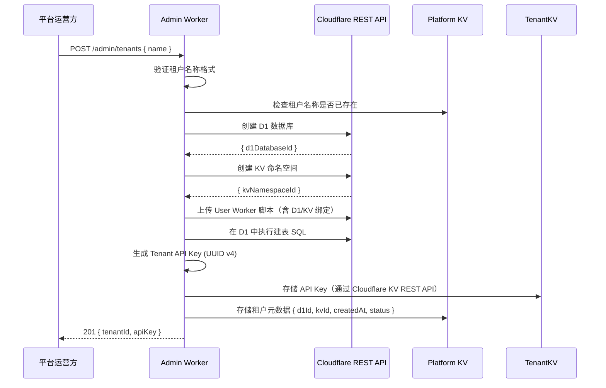

# 技术设计文档：Cloudflare Workers Todo 多租户平台

## 概述

本平台基于 **Cloudflare Workers for Platforms** 构建多租户 Todo List 服务。平台运营方通过一个 **Dispatch Worker** 统一接收所有入站请求，根据请求中的租户标识将流量路由至对应租户的 **User Worker**。每个租户的 User Worker 在运行时动态注入独立的 D1 数据库和 KV 命名空间绑定，从而在架构层面实现数据完全隔离。

平台由两个主要运行时组件构成：

- **Dispatch Worker**：平台入口，负责租户识别与请求路由。
- **User Worker**（每租户一份脚本，运行时绑定不同资源）：负责身份验证与 Todo CRUD 业务逻辑。

平台运营方通过 **Platform Admin API**（独立的管理 Worker）管理租户生命周期，包括创建/删除租户、绑定自定义域名等。

### 关键技术选型

| 组件 | 技术 | 理由 |
|------|------|------|
| 运行时 | Cloudflare Workers (ES Modules) | 边缘计算，零冷启动，原生支持 WfP |
| 多租户路由 | Workers for Platforms Dispatch Namespace | 官方多租户方案，支持动态绑定注入 |
| 租户数据存储 | Cloudflare D1 (SQLite) | 每租户独立实例，SQL 查询，适合结构化 Todo 数据 |
| 租户配置/认证 | Cloudflare Workers KV | 低延迟键值读取，适合 API Key 验证 |
| 语言 | TypeScript | 类型安全，与 Cloudflare SDK 集成良好 |
| 包管理 | npm + Wrangler | Cloudflare 官方工具链 |

---

## 架构

### 整体架构图



### 请求生命周期



### 租户创建流程



---

## 组件与接口

### 1. Platform Admin Worker

**职责**：管理租户生命周期，调用 Cloudflare REST API 操作云资源。

**路由表**：

| 方法 | 路径 | 描述 |
|------|------|------|
| POST | `/admin/tenants` | 创建租户 |
| GET | `/admin/tenants` | 查询所有租户列表 |
| DELETE | `/admin/tenants/:tenantId` | 删除租户 |
| POST | `/admin/tenants/:tenantId/domains` | 绑定自定义域名 |
| DELETE | `/admin/tenants/:tenantId/domains/:domain` | 解绑自定义域名 |

**环境绑定**：

```typescript
interface AdminEnv {
  PLATFORM_KV: KVNamespace;       // 租户注册表
  CF_ACCOUNT_ID: string;          // Cloudflare Account ID (secret)
  CF_API_TOKEN: string;           // Cloudflare API Token (secret)
  DISPATCH_NAMESPACE_NAME: string; // Dispatch Namespace 名称
  USER_WORKER_SCRIPT: string;     // User Worker 脚本内容 (secret/asset)
}
```

**创建租户接口**：

```
POST /admin/tenants
Content-Type: application/json

{ "name": "tenant-a" }

→ 201 Created
{ "tenantId": "tenant-a", "apiKey": "uuid-v4-string", "createdAt": "ISO8601" }
```

### 2. Dispatch Worker

**职责**：识别租户身份，从 Platform KV 获取资源绑定 ID，通过 `dispatchNamespace.get()` 注入绑定并转发请求。

**环境绑定**：

```typescript
interface DispatchEnv {
  DISPATCHER: DispatchNamespace;  // Workers for Platforms dispatch namespace
  PLATFORM_KV: KVNamespace;       // 租户注册表（读取 d1Id、kvId）
}
```

**核心路由逻辑**：

```typescript
// 从 Header 提取租户 ID
const tenantId = request.headers.get("X-Tenant-ID");

// 从 Platform KV 获取租户资源绑定信息
const tenantMeta = await env.PLATFORM_KV.get(`tenant:${tenantId}`, "json");

// 通过 dispatchNamespace.get() 注入租户专属绑定
const userWorker = env.DISPATCHER.get(tenantId, {
  bindings: {
    DB: { type: "d1", id: tenantMeta.d1DatabaseId },
    KV: { type: "kv_namespace", id: tenantMeta.kvNamespaceId },
  },
});

return userWorker.fetch(request);
```

**自定义域名路由**：当请求来自已绑定的自定义域名时，通过 Cloudflare Workers Routes 直接将流量路由至 Dispatch Worker，并在 Platform KV 中维护 `domain:{hostname}` → `tenantId` 的映射，Dispatch Worker 在缺少 `X-Tenant-ID` Header 时回退到域名查找。

### 3. User Worker（每租户共享脚本，运行时绑定不同资源）

**职责**：验证 API Key，处理 Todo CRUD 请求。

**环境绑定**（由 Dispatch Worker 在运行时注入）：

```typescript
interface UserEnv {
  DB: D1Database;      // 该租户专属 D1 数据库
  KV: KVNamespace;     // 该租户专属 KV 命名空间
}
```

**路由表**：

| 方法 | 路径 | 描述 |
|------|------|------|
| GET | `/todos` | 查询 Todo 列表（支持 `?status=` 过滤） |
| POST | `/todos` | 创建 Todo |
| GET | `/todos/:id` | 查询单条 Todo |
| PATCH | `/todos/:id` | 更新 Todo |
| DELETE | `/todos/:id` | 删除 Todo |

**认证中间件**：

```typescript
async function authenticate(request: Request, env: UserEnv): Promise<boolean> {
  const authHeader = request.headers.get("Authorization");
  if (!authHeader?.startsWith("Bearer ")) return false;
  const token = authHeader.slice(7);
  const stored = await env.KV.get(`apikey:${token}`);
  return stored !== null;
}
```

---

## 数据模型

### D1 数据库 Schema（每租户独立实例）

```sql
CREATE TABLE IF NOT EXISTS todos (
  id          TEXT PRIMARY KEY,           -- UUID v4
  title       TEXT NOT NULL,              -- 最大 255 字符
  description TEXT NOT NULL DEFAULT '',   -- 可为空字符串
  status      TEXT NOT NULL DEFAULT 'pending'
                CHECK (status IN ('pending', 'completed')),
  created_at  TEXT NOT NULL,              -- ISO 8601 UTC
  updated_at  TEXT NOT NULL               -- ISO 8601 UTC
);

CREATE INDEX IF NOT EXISTS idx_todos_status ON todos(status);
CREATE INDEX IF NOT EXISTS idx_todos_created_at ON todos(created_at DESC);
```

### KV 数据结构（每租户独立命名空间）

| Key 格式 | Value | 描述 |
|----------|-------|------|
| `apikey:{token}` | `"valid"` | API Key 有效性标记 |

### Platform KV 数据结构（平台级，Admin Worker 使用）

| Key 格式 | Value (JSON) | 描述 |
|----------|--------------|------|
| `tenant:{tenantId}` | `TenantMeta` | 租户元数据 |
| `domain:{hostname}` | `tenantId` | 自定义域名映射 |

```typescript
interface TenantMeta {
  tenantId: string;
  d1DatabaseId: string;
  kvNamespaceId: string;
  apiKey: string;          // 存储用于管理目的（可选，也可仅存 KV 中）
  createdAt: string;       // ISO 8601
  status: "active" | "deleted";
  customDomains: string[]; // 已绑定的自定义域名列表
}
```

### Todo 对象（API 响应格式）

```typescript
interface Todo {
  id: string;          // UUID v4
  title: string;       // 1–255 字符
  description: string; // 可为空字符串
  status: "pending" | "completed";
  created_at: string;  // ISO 8601 UTC，如 "2024-01-15T10:30:00.000Z"
  updated_at: string;  // ISO 8601 UTC
}
```

### API 请求/响应 Schema

**创建 Todo（POST /todos）**：

```typescript
// 请求体
interface CreateTodoRequest {
  title: string;        // 必填，1–255 字符
  description?: string; // 可选
}

// 成功响应 201
Todo

// 错误响应
interface ErrorResponse {
  error: string;        // 描述性错误信息
}
```

**更新 Todo（PATCH /todos/:id）**：

```typescript
// 请求体（至少包含一个字段）
interface UpdateTodoRequest {
  title?: string;                      // 1–255 字符
  description?: string;
  status?: "pending" | "completed";
}

// 成功响应 200
Todo
```

---

## 正确性属性

*属性（Property）是在系统所有合法执行中都应成立的特征或行为——本质上是对系统应做什么的形式化陈述。属性是人类可读规范与机器可验证正确性保证之间的桥梁。*

### 属性 1：Todo 创建后可查询到

*对于任意* 合法的 Todo 创建请求（title 非空且长度 ≤ 255），创建成功后，通过 GET `/todos/:id` 查询返回的 Todo 对象应与创建时返回的对象字段完全一致。

**验证：需求 4.1、4.2、4.3、4.4、4.5、5.3**

### 属性 2：空白 title 被拒绝

*对于任意* 仅由空白字符（空格、制表符、换行符等）组成的字符串作为 `title`，创建 Todo 的请求应被拒绝（返回 HTTP 400），且数据库中的 Todo 数量不变。

**验证：需求 4.6**

### 属性 3：title 长度超限被拒绝

*对于任意* 长度超过 255 个字符的 `title` 字符串，创建或更新 Todo 的请求应被拒绝（返回 HTTP 400），且数据库状态不变。

**验证：需求 4.7、6.6**

### 属性 4：Todo 更新后字段正确反映

*对于任意* 已存在的 Todo 和任意合法的更新字段组合（title、description、status 中的一个或多个），更新成功后返回的 Todo 对象中被更新的字段应等于请求中提供的新值，未更新的字段应保持原值不变，且 `updated_at` 应晚于或等于更新前的 `updated_at`。

**验证：需求 6.1、6.2、6.3、6.4**

### 属性 5：状态过滤正确性

*对于任意* 包含若干 Todo 的租户数据库，使用 `?status=pending` 或 `?status=completed` 过滤查询时，返回列表中的每一条 Todo 的 `status` 字段都应等于过滤参数值，且不应遗漏任何匹配的 Todo。

**验证：需求 5.2**

### 属性 6：删除后不可查询

*对于任意* 已存在的 Todo，删除成功（HTTP 204）后，再次通过 GET `/todos/:id` 查询该 Todo 应返回 HTTP 404。

**验证：需求 7.1、7.2、7.3**

### 属性 7：无效 API Key 被拒绝

*对于任意* 不存在于 KV 中的 token 字符串，使用该 token 作为 Bearer Token 发起的任何请求都应返回 HTTP 401，且不执行任何数据库操作。

**验证：需求 3.3、3.4**

### 属性 8：租户数据隔离

*对于任意* 两个不同的租户 A 和 B，租户 A 的 User Worker 执行的任何查询（SELECT、INSERT、UPDATE、DELETE）都只能影响租户 A 的 D1 数据库中的数据，不能读取或修改租户 B 的数据。

**验证：需求 5.5、7.4、9.1、9.2、9.3**

---

## 错误处理

### HTTP 状态码规范

| 状态码 | 场景 |
|--------|------|
| 200 | 更新成功 |
| 201 | 创建成功 |
| 204 | 删除成功（无响应体） |
| 400 | 请求参数非法（缺少必填字段、格式错误、空更新体等） |
| 401 | 缺少或无效的 Authorization Header |
| 404 | 资源不存在（租户、Todo、域名等） |
| 409 | 资源冲突（租户名称重复、域名已被绑定） |
| 500 | 服务器内部错误 |

### 错误响应格式

所有错误响应统一使用 JSON 格式：

```json
{
  "error": "描述性错误信息"
}
```

### 各层错误处理策略

**Dispatch Worker**：
- 缺少 `X-Tenant-ID` Header → 400
- 租户不存在（Platform KV 无记录）→ 404
- User Worker 抛出 `Worker not found` 异常 → 404
- 其他异常 → 500，记录错误日志

**User Worker**：
- 认证失败 → 401，立即返回，不执行业务逻辑
- 输入验证失败 → 400，返回具体字段错误信息
- D1 查询无结果 → 404
- D1 约束违反（如 status CHECK 失败）→ 400
- 未预期的 D1 错误 → 500

**Admin Worker**：
- 租户名称格式校验失败 → 400
- 租户已存在 → 409
- Cloudflare API 调用失败 → 500，附带 CF API 错误详情（脱敏后）

### 输入验证规则

```typescript
// 租户名称验证
const TENANT_NAME_REGEX = /^[a-zA-Z0-9-]{3,63}$/;

// title 验证
function validateTitle(title: unknown): string | null {
  if (typeof title !== "string") return "title 必须为字符串";
  if (title.trim().length === 0) return "title 不能为空或纯空白";
  if (title.length > 255) return "title 长度不能超过 255 个字符";
  return null; // 合法
}

// status 验证
const VALID_STATUSES = new Set(["pending", "completed"]);
```

---

## 测试策略

### 测试分层

```
┌─────────────────────────────────────────────────────┐
│  集成测试 (Miniflare / Wrangler dev)                 │
│  - 端到端请求流程（Dispatch → User Worker）          │
│  - 租户创建/删除完整流程                             │
│  - 自定义域名路由                                    │
├─────────────────────────────────────────────────────┤
│  属性测试 (fast-check)                               │
│  - 覆盖正确性属性 1–8                                │
│  - 每个属性最少运行 100 次迭代                       │
├─────────────────────────────────────────────────────┤
│  单元测试 (Vitest)                                   │
│  - 输入验证函数                                      │
│  - 路由解析逻辑                                      │
│  - 错误处理边界条件                                  │
└─────────────────────────────────────────────────────┘
```

### 属性测试配置（fast-check）

选用 **[fast-check](https://fast-check.io/)** 作为属性测试库（TypeScript 原生支持，与 Vitest 集成良好）。

每个属性测试使用 Miniflare 模拟 D1 和 KV 绑定，避免真实 Cloudflare API 调用。

```typescript
// 示例：属性 1 - Todo 创建后可查询到
// Feature: cloudflare-workers-todo-platform, Property 1: Todo 创建后可查询到
test("属性 1：Todo 创建后可查询到", async () => {
  await fc.assert(
    fc.asyncProperty(
      fc.record({
        title: fc.string({ minLength: 1, maxLength: 255 }).filter(s => s.trim().length > 0),
        description: fc.option(fc.string(), { nil: undefined }),
      }),
      async ({ title, description }) => {
        const createRes = await userWorker.fetch("/todos", {
          method: "POST",
          body: JSON.stringify({ title, description }),
          headers: { "Content-Type": "application/json", Authorization: `Bearer ${validApiKey}` },
        });
        expect(createRes.status).toBe(201);
        const created = await createRes.json() as Todo;

        const getRes = await userWorker.fetch(`/todos/${created.id}`, {
          headers: { Authorization: `Bearer ${validApiKey}` },
        });
        expect(getRes.status).toBe(200);
        const fetched = await getRes.json() as Todo;
        expect(fetched).toEqual(created);
      }
    ),
    { numRuns: 100 }
  );
});
```

**属性测试标签格式**：每个属性测试注释中标注：
`Feature: cloudflare-workers-todo-platform, Property {N}: {属性描述}`

### 单元测试重点

- `validateTitle()`：空字符串、纯空白、超长字符串、正常字符串
- `validateTenantName()`：格式合法/非法的各种边界值
- `authenticate()`：缺少 Header、格式错误、无效 token、有效 token
- Dispatch Worker 路由逻辑：Header 存在/缺失、租户存在/不存在

### 集成测试重点

- 完整的租户创建流程（含 D1 建表验证）
- 跨租户数据隔离验证（租户 A 无法访问租户 B 的 Todo）
- 自定义域名绑定后的路由验证
- Dispatch Worker 绑定注入正确性

### 测试运行命令

```bash
# 单元测试 + 属性测试（单次运行）
npx vitest run

# 集成测试（需要 Miniflare）
npx vitest run --config vitest.integration.config.ts
```
